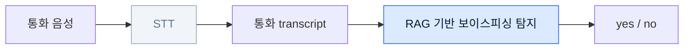
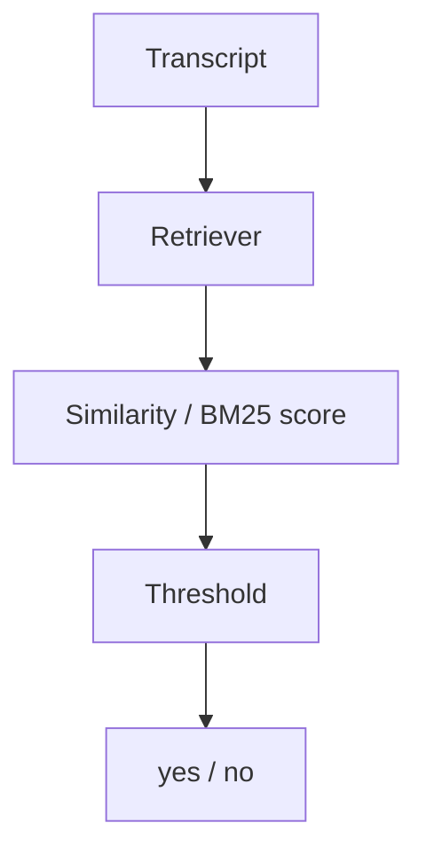
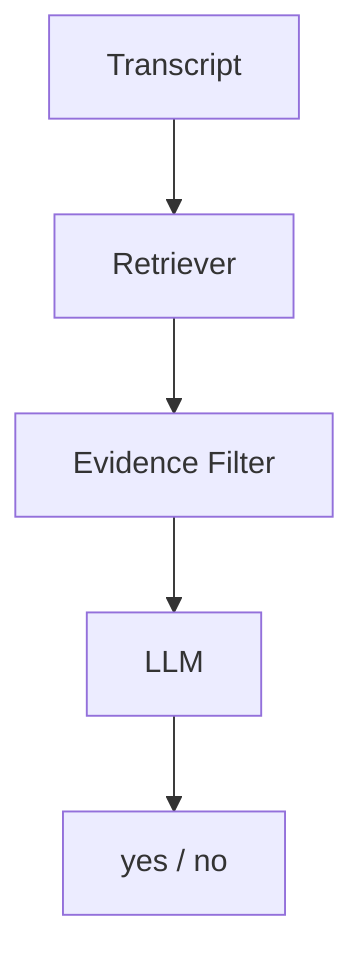
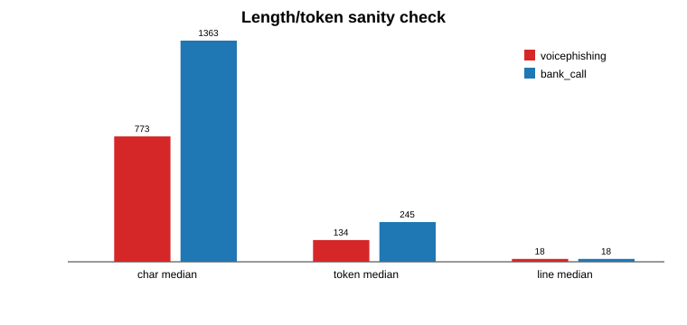

# 보이스피싱 탐지를 위한<br/>개인정보 마스킹 환경의<br/>RAG 시스템 설계

<div class="mt-8 text-xl text-slate-600">
김병욱 · 경희대학교 전자공학과<br/>
졸업프로젝트 최종 발표
</div>

<div class="absolute bottom-10 left-14 text-sm text-slate-500">
Voicephishing Detection · Privacy Masking · Retrieval-Augmented Generation
</div>

---
layout: center
---

# 핵심 질문

<div class="big-quote mt-8">
개인정보를 마스킹해도<br/>
RAG 기반 보이스피싱 탐지 성능을 유지할 수 있을까?
</div>

<div class="mt-8 grid grid-cols-3 gap-4 text-center">
  <div class="card"><div class="eyebrow">Problem</div><b>Masking</b><br/>식별 단서 제거</div>
  <div class="card"><div class="eyebrow">Impact</div><b>Retrieval</b><br/>검색 근거 약화</div>
  <div class="card"><div class="eyebrow">Solution</div><b>Advanced RAG</b><br/>구조적 패턴 활용</div>
</div>

---

# 연구 범위

<div class="grid grid-cols-[1.1fr_0.9fr] gap-8 mt-6 items-center">
<div>



</div>
<div class="space-y-4">
  <div class="card accent-blue">
    <div class="eyebrow">Scope</div>
    STT 이후 생성된 <b>통화 transcript</b>를 입력으로 가정
  </div>
  <div class="card">
    <div class="eyebrow">Not in scope</div>
    STT 모델 자체의 성능 평가는 제외
  </div>
  <div class="card">
    <div class="eyebrow">Focus</div>
    개인정보 마스킹 환경에서 RAG 탐지 성능 변화 분석
  </div>
</div>
</div>

---

# 왜 마스킹이 문제가 되는가?

<div class="grid grid-cols-2 gap-6 mt-6">
<div class="card">
<div class="eyebrow">Original transcript</div>

```text
김하늘 씨 맞으신가요?
국민은행과 카카오뱅크에 보안 점검 이력이 있습니다.
문자로 전용 페이지를 보내드릴 테니
보호 모듈을 설치해 주세요.
```

</div>
<div class="card muted">
<div class="eyebrow">Masked transcript</div>

```text
[이름] 씨 맞으신가요?
[기관명]과 [기관명]에 보안 점검 이력이 있습니다.
문자로 전용 페이지를 보내드릴 테니
보호 모듈을 설치해 주세요.
```

</div>
</div>

<div class="mt-6 callout-red">
Naive RAG는 이름, 기관명, 계좌, 주소처럼 query와 corpus를 직접 이어주던 <b>retrieval anchor</b>를 잃는다.
</div>

---

# 실험 데이터 예시: Voicephishing

<div class="grid grid-cols-[1.25fr_0.75fr] gap-6 mt-4">
<div class="transcript">
<div class="eyebrow mb-3">Positive sample</div>
<p><b>고객센터:</b> 금융보호지원센터 이상거래 확인팀입니다.</p>
<p><b>고객센터:</b> 등록된 성함이 김하늘 씨 맞으신가요?</p>
<p><b>고객센터:</b> 국민은행과 카카오뱅크에 보안 점검 이력이 남아 있습니다.</p>
<p><b>피해자:</b> 제가 한 건 아니에요. 갑자기 왜 이런 확인을 하시죠?</p>
<p><b>고객센터:</b> 전용 페이지로 접속해 보호 모듈을 설치해 주세요.</p>
<p><b>고객센터:</b> 설치 후 표시되는 6자리 확인번호를 입력해 주시면 계정 보호가 완료됩니다.</p>
</div>
<div class="space-y-3">
  <div class="tag-red">전용 페이지 접속</div>
  <div class="tag-red">보호 모듈 설치</div>
  <div class="tag-red">인증번호 입력 요구</div>
  <div class="tag-red">이상거래/보호 절차 명목</div>
</div>
</div>

<div class="mt-4 text-slate-600">
겉으로는 금융 보안 안내처럼 보이지만, 실제로는 링크·앱 설치·인증번호 입력을 유도한다.
</div>

---

# 실험 데이터 예시: Hard Negative

<div class="grid grid-cols-[1.25fr_0.75fr] gap-6 mt-4">
<div class="transcript safe">
<div class="eyebrow mb-3">Bank call hard negative</div>
<p><b>상담원:</b> 최근 비정상 접속 시도가 확인되어 보호성 제한 상태입니다.</p>
<p><b>고객:</b> 어떤 확인을 하면 되나요?</p>
<p><b>상담원:</b> 공식 앱의 알림센터에서 상태를 직접 확인해 주세요.</p>
<p><b>상담원:</b> 인증번호는 절대 말씀해 주실 필요 없습니다.</p>
<p><b>상담원:</b> 대표번호로 다시 걸어 주시면 부서 확인 후 안내드릴 수 있습니다.</p>
<p><b>상담원:</b> 필요 시 가까운 영업점 방문으로 전환하시면 됩니다.</p>
</div>
<div class="space-y-3">
  <div class="tag-green">공식 앱 직접 확인</div>
  <div class="tag-green">인증번호 공유 금지</div>
  <div class="tag-green">대표번호 재연락 가능</div>
  <div class="tag-green">영업점 방문 안내</div>
</div>
</div>

<div class="mt-4 text-slate-600">
금융·보안 표현은 비슷하지만, 사기 유도 행동이 없기 때문에 hard negative로 사용했다.
</div>

---

# Dataset Design

<div class="grid grid-cols-3 gap-5 mt-8">
  <div class="metric-card">
    <div class="metric">1,000</div>
    <div class="label">augmented hard benchmark</div>
  </div>
  <div class="metric-card red">
    <div class="metric">500</div>
    <div class="label">voicephishing positive</div>
  </div>
  <div class="metric-card green">
    <div class="metric">500</div>
    <div class="label">bank call hard negative</div>
  </div>
</div>

<div class="mt-8 callout-blue">
Irrelevant sample은 너무 쉽게 no로 분류되는 경우가 많아 최종 주요 비교에서는 제외했다.
</div>

<div class="mt-6 grid grid-cols-2 gap-4">
  <div class="card muted"><b>Easy negative</b><br/>일상 대화, 날씨, 음식 주문 → 너무 쉽게 no</div>
  <div class="card accent-blue"><b>Hard negative</b><br/>정상 금융 보안 안내 → 표현은 유사하지만 사기 행동은 없음</div>
</div>

---

# 비교한 세 가지 Pipeline

<div class="grid grid-cols-3 gap-5 mt-8">
  <div class="pipeline-card">
    <div class="eyebrow">Pipeline 1</div>
    <h3>Original<br/>Naive RAG</h3>
    <p>원본 corpus 기반 BM25 retrieval</p>
  </div>
  <div class="pipeline-card muted">
    <div class="eyebrow">Pipeline 2</div>
    <h3>Masked<br/>Naive RAG</h3>
    <p>개인정보 마스킹 corpus 기반 BM25 retrieval</p>
  </div>
  <div class="pipeline-card accent">
    <div class="eyebrow">Pipeline 3</div>
    <h3>Masked<br/>Advanced RAG</h3>
    <p>구조적 보이스피싱 패턴 + 정상 금융상담 guard</p>
  </div>
</div>

<div class="mt-8 text-center text-xl font-semibold text-blue-700">
목표: Masked Naive의 성능 저하를 확인하고, Advanced RAG로 회복 가능한지 검증
</div>

---

# Two Evaluation Tracks

<div class="grid grid-cols-2 gap-6 mt-6">
<div class="track-card">
<div class="eyebrow">Track A · Lightweight detection</div>



<ul>
<li>LLM 호출 없음</li>
<li>낮은 비용과 latency</li>
<li>실시간 1차 탐지 가능성 확인</li>
</ul>
</div>

<div class="track-card">
<div class="eyebrow">Track B · End-to-end RAG</div>



<ul>
<li>RAG 전체 pipeline 기준 평가</li>
<li>LLM 판단 포함</li>
<li>retrieved evidence 기반 최종 응답</li>
</ul>
</div>
</div>

<div class="mt-5 callout-blue">
보이스피싱 탐지는 통화 중 빠른 판단이 중요하므로, LLM 기반 방식뿐 아니라 retrieval-only 경량 탐지도 함께 평가했다.
</div>

---

# 왜 Retrieval-only도 중요한가?

<div class="grid grid-cols-[0.9fr_1.1fr] gap-8 mt-6 items-center">
<div class="space-y-4">
  <div class="card"><b>API 비용</b><br/>매 통화마다 LLM 호출 시 비용 발생</div>
  <div class="card"><b>Latency</b><br/>실시간 경고에는 빠른 판단이 필요</div>
  <div class="card"><b>On-device 부담</b><br/>내장 LLM 사용 시 배터리·연산 자원 부담</div>
  <div class="card"><b>Privacy</b><br/>통화 transcript를 외부 API로 보내는 부담</div>
</div>
<div>
  <div class="big-number">LLM 없이도?</div>
  <div class="text-2xl mt-4 font-semibold">
    Retrieval score + threshold만으로<br/>1차 탐지가 가능한지 확인
  </div>
  <div class="mt-6 text-slate-600">
    동시에 LLM 사전지식 개입을 줄이고, 마스킹이 검색 단계에 미치는 영향을 더 직접적으로 볼 수 있다.
  </div>
</div>
</div>

---

# Advanced RAG: 핵심 아이디어

<div class="big-quote mt-4">
개인정보가 사라져도,<br/>사기 행위의 구조는 남아 있다.
</div>

<div class="grid grid-cols-2 gap-6 mt-8">
<div class="card muted">
<div class="eyebrow">Masked Naive RAG</div>
<ul>
<li>이름, 기관명, 계좌번호 등 anchor 약화</li>
<li>query-context 연결 근거 부족</li>
<li>retrieval score 하락</li>
</ul>
</div>
<div class="card accent-blue">
<div class="eyebrow">Masked Advanced RAG</div>
<ul>
<li>수사기관/금융기관 사칭 흐름</li>
<li>이상거래/명의도용 명목</li>
<li>링크·앱 설치·인증번호 요구</li>
<li>송금/안전계좌 유도</li>
<li>정상 금융상담 guard</li>
</ul>
</div>
</div>

---

# Retrieval-based Result

<div class="grid grid-cols-[0.95fr_1.05fr] gap-6 mt-5 items-center">
<div>

| Pipeline | Accuracy |
|---|---:|
| Original Naive RAG | **0.8210** |
| Masked Naive RAG | **0.5410** |
| Masked Advanced RAG | **0.9110** |

<div class="mt-5 text-slate-600">
LLM 없이 retrieval score와 threshold만으로 평가했다.
</div>
</div>
<div class="space-y-5">
  <div class="result-line"><span>Original</span><div class="bar" style="width:82.1%"></div><b>0.821</b></div>
  <div class="result-line"><span>Masked</span><div class="bar red" style="width:54.1%"></div><b>0.541</b></div>
  <div class="result-line"><span>Advanced</span><div class="bar green" style="width:91.1%"></div><b>0.911</b></div>
</div>
</div>

<div class="mt-5 callout-red">
마스킹 후 Naive RAG는 retrieval anchor 손실로 크게 하락했고, Advanced RAG는 구조적 패턴 기반으로 회복했다.
</div>

---

# End-to-End RAG Result

<div class="grid grid-cols-[0.9fr_1.1fr] gap-8 mt-7 items-center">
<div>

| Pipeline | Accuracy |
|---|---:|
| Original RAG | **0.8940** |
| Masked RAG | **0.5130** |
| Masked Advanced RAG | **0.9530** |

</div>
<div class="space-y-4">
  <div class="result-line"><span>Original</span><div class="bar" style="width:89.4%"></div><b>0.894</b></div>
  <div class="result-line"><span>Masked</span><div class="bar red" style="width:51.3%"></div><b>0.513</b></div>
  <div class="result-line"><span>Advanced</span><div class="bar green" style="width:95.3%"></div><b>0.953</b></div>
</div>
</div>

<div class="mt-8 callout-blue">
LLM 최종 판단까지 포함해도 동일한 경향이 나타났다: <b>Masked Naive 하락 → Advanced RAG 회복</b>.
</div>

---

# Sanity Check

<div class="grid grid-cols-[1fr_1fr] gap-6 mt-5">
<div class="space-y-4">
  <div class="check-card">Label balance: voicephishing 500 / bank_call 500</div>
  <div class="check-card">Transcript 내 명시적 label leakage 없음</div>
  <div class="check-card">동일 source sample 직접 retrieval 제외</div>
  <div class="check-card">대화 turn 수 중앙값 유사</div>
  <div class="check-card">bank_call도 금융/보안 표현 포함</div>
</div>
<div class="chart-box">

</div>
</div>

<div class="mt-5 text-slate-600">
평가셋은 완전한 외부 실데이터가 아니라 seed scenario 기반 증강 benchmark이므로, 결과는 hard-negative 조건에서의 비교 evidence로 해석했다.
</div>

---

# 결론

<div class="grid grid-cols-2 gap-5 mt-8">
  <div class="conclusion-card">
    <div class="num">1</div>
    개인정보 마스킹은 RAG의 retrieval anchor를 약화시켜 성능 저하를 만들었다.
  </div>
  <div class="conclusion-card">
    <div class="num">2</div>
    Retrieval-only 평가는 경량 탐지 가능성과 검색 단계 영향 분석에 유용했다.
  </div>
  <div class="conclusion-card">
    <div class="num">3</div>
    End-to-end RAG에서도 masked naive의 성능 하락이 확인되었다.
  </div>
  <div class="conclusion-card accent">
    <div class="num">4</div>
    Advanced RAG는 개인정보 단서 대신 보이스피싱 구조적 패턴을 활용해 masked 환경의 성능을 회복했다.
  </div>
</div>

---

# 한계 및 향후 과제

<div class="grid grid-cols-2 gap-6 mt-8">
<div class="card">
<div class="eyebrow">Limitations</div>
<ul>
<li>1000개 benchmark는 seed scenario 기반 증강 데이터</li>
<li>실제 통화 데이터 기반 검증은 추가 필요</li>
<li>보이스피싱/정상 금융 상담 유형 확장 필요</li>
</ul>
</div>
<div class="card accent-blue">
<div class="eyebrow">Future Work</div>
<ul>
<li>실제 STT noise 반영 확대</li>
<li>Advanced RAG 구성 요소별 ablation</li>
<li>실시간 탐지 threshold calibration</li>
<li>데모 UI 또는 경고 시스템 연결</li>
</ul>
</div>
</div>

---
layout: center
---

# Q&A

<div class="mt-8 text-xl text-slate-600">
GitHub: <span class="font-mono">github.com/bwook00/Phishing_Call_Detector</span>
</div>

<div class="mt-8 text-slate-500">
감사합니다.
</div>
